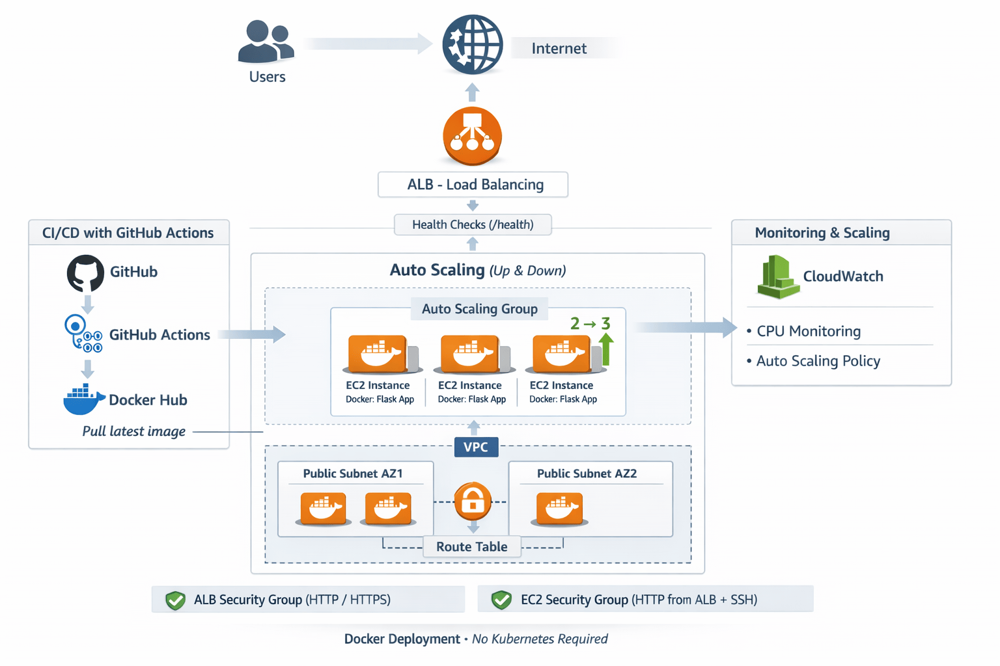

# 🏗️ AWS DevOps Production Kit – Architecture

This document explains the architecture of the AWS DevOps Production Kit in a simple and clear way.

---

# 🎯 Overview

This project demonstrates a **production-ready DevOps system** built using:

* AWS (EC2, ALB, Auto Scaling, VPC, CloudWatch)
* Terraform (Infrastructure as Code)
* Docker (Application containerization)
* GitHub Actions (CI/CD)

The system is designed to be:

* Scalable 📈
* Highly available 🌍
* Automated 🔄
* Beginner-friendly 🚀

---

# 🧠 High-Level Architecture

```text
Users → Internet → ALB → Target Group → Auto Scaling Group → EC2 → Docker App
```

---

# 🏗️ Architecture Diagram



---

# ⚙️ Core Components

## 🌐 1. VPC (Virtual Private Cloud)

* CIDR: `10.0.0.0/16`
* Provides isolated network environment
* All resources are deployed inside the VPC

---

## 🧩 2. Public Subnets

* Subnet 1: `10.0.1.0/24` (AZ1)
* Subnet 2: `10.0.2.0/24` (AZ2)

Purpose:

* High availability across Availability Zones
* Host EC2 instances and ALB

---

## 🌍 3. Internet Gateway

* Enables internet access
* Required for public web applications

---

## 🛣️ 4. Route Table

* Routes `0.0.0.0/0` traffic to Internet Gateway
* Allows inbound and outbound internet traffic

---

## 🔐 5. Security Groups

### ALB Security Group

* Allows HTTP (port 80) from the internet

### EC2 Security Group

* Allows HTTP from ALB
* Allows SSH (port 22) for admin access

---

## ⚖️ 6. Application Load Balancer (ALB)

* Distributes incoming traffic
* Routes requests to healthy EC2 instances
* Improves availability and reliability

---

## 🎯 7. Target Group

* Holds EC2 instances
* Performs health checks

Health Check:

```text
/health
```

---

## 📈 8. Auto Scaling Group (ASG)

* Manages EC2 instances automatically
* Scales based on CPU usage

### Behavior:

* Scale Up:

  * CPU increases → new instance launched

* Scale Down:

  * CPU decreases → instance terminated

* Self-healing:

  * Unhealthy instance → replaced automatically

---

## 🚀 9. Launch Template

Defines how EC2 instances are created:

* AMI (Amazon Linux)
* Instance type
* Key pair
* Security groups
* Docker installation
* Application deployment (user_data)

---

## 🖥️ 10. EC2 Instances

Each instance:

* Runs inside Auto Scaling Group
* Installs Docker automatically
* Pulls application image
* Runs Flask app container

---

## 🐳 11. Dockerized Application

* Flask app inside Docker container
* Runs on port `5000`
* Exposed via port `80`

Purpose:

* Consistency across environments
* Easy deployment

---

## ⚙️ 12. CI/CD (GitHub Actions)

Workflow:

1. Code pushed to GitHub
2. GitHub Actions builds Docker image
3. Image pushed to Docker Hub
4. EC2 instances pull latest image

---

## 📦 13. Docker Hub

* Stores Docker image
* Acts as registry for deployment

Example:

```text
mohanbakthi/mohan-flask-app:latest
```

---

## 📊 14. CloudWatch Monitoring

* Tracks CPU usage
* Provides visibility into system performance
* Works with Auto Scaling

---

# 🔄 System Flow

## 🚀 Request Flow

```text
User → ALB → Target Group → EC2 → Docker → Flask App
```

---

## 🔄 Deployment Flow

```text
GitHub → GitHub Actions → Docker Hub → EC2 Instances
```

---

## 📈 Scaling Flow

### Scale Up

```text
Traffic ↑ → CPU ↑ → ASG → New Instance 🚀
```

### Scale Down

```text
Traffic ↓ → CPU ↓ → ASG → Instance Terminated 💸
```

---

# 🌍 High Availability Design

* Multi-AZ deployment
* Load balancer distributes traffic
* Auto Scaling ensures uptime
* No single point of failure

---

# 🔐 Security Design

* Separate security groups
* Controlled inbound traffic
* SSH access limited
* Secrets stored in GitHub
* Private key not stored in repo

---

# 💰 Cost Optimization

* Auto Scaling reduces unused instances
* Scale-down ensures lower cost
* Suitable for near free-tier usage (with caution)

---

# 🚀 Why This Architecture?

✔ Simple but production-like
✔ No Kubernetes complexity
✔ Easy to understand and extend
✔ Suitable for beginners and real-world learning

---

# 🔮 Future Improvements

* HTTPS with ACM
* Route53 custom domain
* ECR integration
* Logging (CloudWatch Logs)
* Blue/Green deployment
* Private subnets + NAT Gateway

---

# 🎯 Summary

This architecture combines:

* Infrastructure (Terraform)
* Compute (EC2)
* Scaling (ASG)
* Load Balancing (ALB)
* Deployment (Docker + CI/CD)
* Monitoring (CloudWatch)

👉 Result: A **production-ready DevOps system without Kubernetes**
